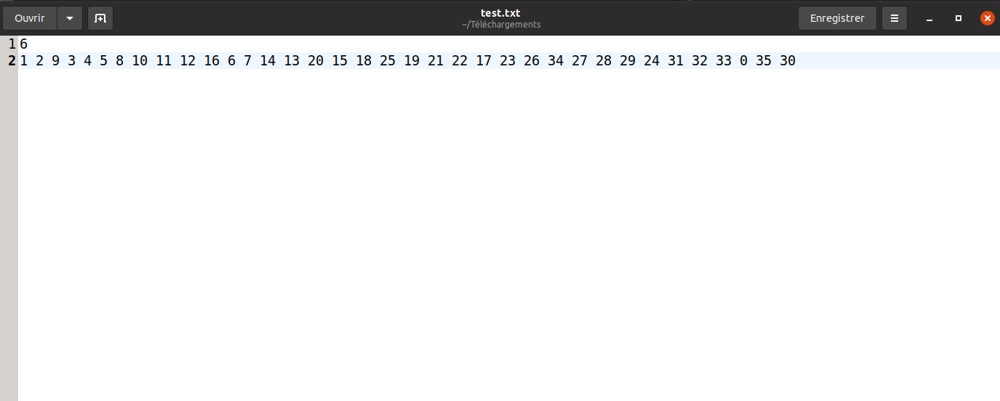
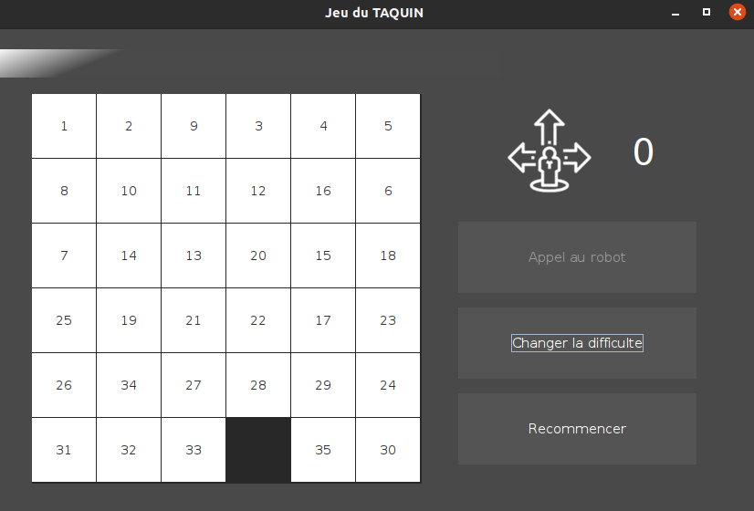

# Jeu du Taquin


-------------------------------------------------------------------
-------------------------------------------------------------------

# Sommaire
 - [Présentation du jeu](#présentation-du-jeu)
 - [Importation de son jeu](#importation-de-son-propre-jeu)
 - [Utilisation des commandes](#utilisation-des-commandes)
 - [Génération de la Javadoc](#génération-de-la-javadoc)
 - [Informations utiles](#informations-utiles)
 
------------------------------------------------------------------
------------------------------------------------------------------

# Présentation du jeu

Le taquin est un jeu solitaire. Normalement, il est composé de 15 petits carreaux numérotés de 1 à 15 qui glissent dans un cadre prévu pour 16. Il consiste à remettre dans l'ordre les 15 carreaux à partir d'une configuration initiale quelconque.

Le principe a été étendu à toutes sortes d'autres jeux. Dans notre jeu, le joueur peut choisir la difficulté de son niveau ainsi que sa taille. Mais le but est toujours de disposer les blocs d'une façon déterminée par un nombre minimal de mouvements. _Le Rubik's Cube est aujourd'hui considéré comme l'un des « descendants » du taquin._


-------------------------------------------------------------------
-------------------------------------------------------------------

# Importation de son propre jeu

Depuis la dernière mise à jour, notre jeu vous propose d'importer votre propre plateau et jouer sur notre interface graphique. Pour respecter correctement l'écriture et la syntaxe de nos fichiers, nous vous proposons un petit tutoriel.

- Ouvrez un fichier de type `.txt`.
- Écrivez sur la première ligne la taille de votre plateau.
- Écrivez sur la deuxième ligne les chiffres dans l'ordre espacé avec des espaces.

Attention : le nombre de chiffres écrits sur la deuxième ligne doit être égale à la taille * la taille du chiffre écrit sur la première ligne. 
Attention 2 : Le 0 signifie le trou, n'oubliez pas de le placer.

EXEMPLE : (pour un plateau de taille 6)

**Présentation du fichier `.txt` :**



**Résultat sur l'interface graphique :**




-------------------------------------------------------------------

# Utilisation des commandes

Ouvrez un terminal, et allez dans le dossier principal.

## _Compilation de jeu_
Pour compiler le jeu, il suffit d'entrer la commande suivante :

```
javac Main.java
```

## _Exécution de jeu_

L'exécution de notre jeu se fait en deux grandes parties :

1. Jouer au jeu et utiliser les algorithmes pour résoudre les jeux générés ou ceux importés
2. Regarder les statistiques de nos algorithmes et voir leur efficacité


-------------------------------------------------------------------
### Jouer au jeu et utiliser les algorithmes pour résoudre les jeux générés ou ceux importés :


L'utilisateur peut tout de suite exécuter le jeu sur une interface graphique ou sur le terminal selon son choix.

- Si l'utilisateur veut utiliser l'interface graphique, il peut alors lancer la commande suivante :

```
java Main GUI
```

- Si l'utilisateur veut utiliser le terminal, il peut alors lancer la commande suivante :

```
java Main terminal
```

-------------------------------------------------------------------

### Regarder les statistiques de nos algorithmes et voir leur efficacité

Voici la commande générale pour tester les algorithmes :

```
java Main --algo=[...] --taille=[...] --niveau=[...]
```

Plusieurs arguments sont possibles dans `--algo=[...]` :

- "pl" : pour le parcours en largeur
- "dj" : pour l'algorithme de Dijkstra
- "astar" : pour l'algorithme de A* (avec le nombre de cases mal placées comme heuristique)
- "astarManhattan" : pour l'algorithme de A* (avec la distance de Manhattan comme heuristique)
- "all" : pour tous les algorithmes en même temps

Plusieurs arguments sont possibles dans `--niveau=[...]` :

- "1" : Niveau facile
- "2" : Niveau moyen
- "3" : Niveau difficile
- "4" : Mode aléatoire

-------------------------------------------------------------------
## Génération de la Javadoc

Pour faciliter la compréhension du code Java, les utilisateurs ont aussi la possibilité de générer la Javadoc de tous les **packages** présents dans un dossier qu'ils choisissent. Pour se faire, il faut lancer la commande suivante :

```
javadoc -d [*le_chemin_du_dossier_où_vous_voulez_votre_javadoc*] algorithmes launcher objects
```

-------------------------------------------------------------------

## Informations utiles

### Listes des contributeurs
- Mathieu AFONSO PECADO
- Tara AGGOUN
- Jasmin JOKSIMOVIC
- Elody TANG
